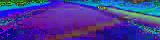
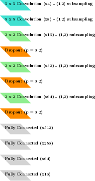

# Steering Angle Prediction for Simulated Automated Driving

The purpose of this work is personal scholarship - a number of neural network architectures, including pre-trained models (VGG16, InceptionV3, ResNet50) were applied to the problem of steering angle prediction in self driving vehicles. The sources contained here represent the final version of this effort, and include a convolutional network based on a highly efficient architecture published by NVidia. See below for further details.

## Overview
This project contains a very simple 'autopilot' for the Udacity SDCND simulator. Based on visual images alone from a single front-facing camera, a convolutional neural network is applied to predict steering angle, while the vehicle maintains a constant speed (obvious future extensions abound...).

## Data
The training and testing data consists of many thousands of images captured on training laps in the simulator, and the steering angles with which they are associated. Furthermore, many more images are produced by data augmentation, including the use of images from cameras on the sides of the vehicle.

As the training, validation, and testing data is quite large, it is not included in this repository. It is available on request.

## Further details

### Image pre-processing
A very simple pre-processing pipeline is applied to each image.

1. CLAHE is applied to the RGB image.
2. The image is cropped, to exclude as much of the background as possible, and the hood of the vehicle.
3. The image is resized to 40 x 160.
4. The image is converted to the HSV color space.

**A sample pre-processed image.** Note that the colors appear modified - this is to reflect the transormation to HSV, the image is shown here without re-conversion to a different space for viewing.

### Model Architecture
Briefly, the architecture applied here is defined in `model.py` and is implemented with Keras. It is based on the architecture used by NVidia to successfully pilot a vehicle in the publication 'End to End Learnig for Self Driving Cars' **[1]**. On the development machine (see below) the model performs extremely quickly, and training is rapid. The model implemented here is somewhat smaller than that of the original authors, and includes additional facilities for preventing overfitting - deemed necessary due to the limied available training environment. The diagram below illustrates the modified architecture applied here. Of note, the the third 5x5 convolution of the NVidia network is changed to a 3x3 convolution. To save resources, image input to the network are pre-processed more extensively, and are resized to be smaller than those used in the NVidia model.

Note the addition of three dropout layers (with p = 0.2) between the final three convolutions, to help mitigate overfitting. When regularization was applied to the fully connected layer, the model tended to become stuck a local minima of the loss function corresponding to a constant steering angle regardless of the input image. After extensive experimentation, only the dropout layers were incorporated into the final model.

Non-negligible image pre-processing is carried out on each image fed to the model - including histogram normalization (CLAHE), cropping, color-space conversion, etc. as described above.

`training.py` has a simple command line interface. Generally training/testing images are preprocessed separately to speed up model training. The flag `--skip-training` enables the user to halt after pre-processing the training/testing data, without training the model. The flat `--skip-preproc` enables training of the model without re-processing the training/testing data, which is not necessary if simple markdchanges in the model are being evaluated.

## Training
Training was carried out exclusively with images from the first track. The training images were all captured an an approximate speed of 10 mph. This data includes:

- 6 forward laps of the track
- 2 reverse laps of the track
- A large number of individual recordings where the vehicle is recovering from an off-road position.
- A number of additional runs through the tight penultimate bends of the track.

Data from all three cameras was used for training, as per the method of **[1]** where data from the additional cameras simulates recovery without the need for a driver to weave about gathering training data. A constant of '0.15' is added/subtracted from the left/right camera feed, for each such image.

While it is suggested in the corresponding Udacity lessons, no mirroring was performed, as such symmetric data tended to consistently forse the model into a local minima during training which corresponded to a constant steering output.

**Note that all training images are pre-processed in advance, to save time. The model uses a generator to load images in batches of 16, at training time.** This makes training the model very quick to train, once all data has been pre-processed once. It enables more efficient experimentation with different model architectures.

When the model is applied to the simulation, input images are pre-processed before being fed into the model.

For the final model whose performance is shown in the video, an 'Adam' optimizer was used, and the model was trained for 20 epochs.

## Development Machine
Development was carried out on a MacBook Pro 11'3 (nVidia 750M GPU), running Ubuntu 16.10. Python 3.5.2 and Anaconda 4.2 were used here, and Keras was run with a TensorFlow backend, making full use of the system's GPU.

## Final Thoughts
The only true way to make sure that a network for steering angle prediction did not overfit, would be to have it work reasonably well on the second availalbe track. However, they are so different, that this is an unlikely possibility. One might consider much more extensive image preprocessing, to ensure that the model is only presented with images of the road. In subsequent lessons, perpsective transforms etc. are presented which could easily be applied here to ensure that the network only learns based on images of the road shown top-down, making the countour of lane-lines the only salient feature.

Also, the model presented here does tend to make the car 'weave about'. While this is fine here, as long as the car doesn't leave the track, it would certainly be quite uncomfortable for a human driver. The constant added/subtracted the steering angle from the left/right cameras may need to be tuned to correct for this behaviour.

Furthermore, just as the network is trained to predict steering angle, it could be extended, in such an ideal environment where the vehicle is alone on the road, to control the breaking and acceleration of the car as well. The second track has a much more diverse topology and features related to road inclination would also be necessary for such a model to be successful.

Finally, a criticism. The project rubric includes the line 'Training data has been chosen to induce the desired behavior in the simulation.' This can be a dangerous notion, and could have been phrased better. A second track,  more similar to the first than the one provided, or any greater variety of training scenarios, would have been necessary to actually produce a model following sound machine learning practice.

## References
**[1]** Bojarski, Mariusz, Davide Del Testa, Daniel Dworakowski, Bernhard Firner, Beat Flepp, Prasoon Goyal, Lawrence D. Jackel, et al. 2016. “End to End Learning for Self-Driving Cars.” arXiv [cs.CV]. arXiv. http://arxiv.org/abs/1604.07316.
